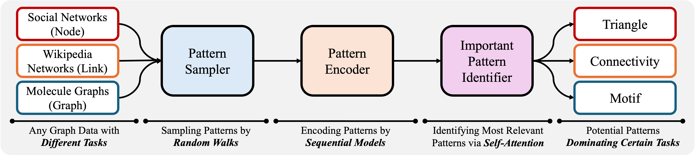
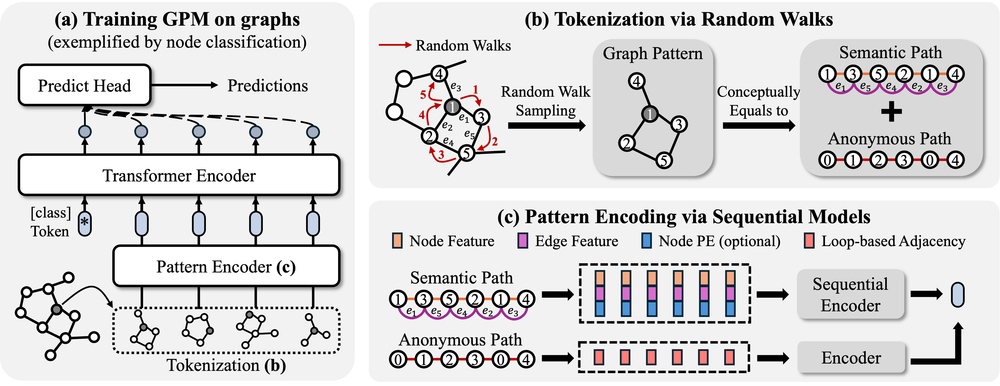

# Beyond Message Passing: Neural Graph Pattern Machine

<div align='center'>

[](https://pytorch.org/get-started/locally/)
[](https://pytorch-geometric.readthedocs.io/en/latest/install/installation.html)

[](https://arxiv.org/abs/2501.18739)


</div>

The official implementation of [Beyond Message Passing: Neural Graph Pattern Machine](https://arxiv.org/abs/2501.18739), ICML 25. We propose GPM, a path towards next-generation graph learning backbone. The logo is generated by DALL·E 3.

Authored by [Zehong Wang](https://zehong-wang.github.io/), [Zheyuan Zhang](https://jasonzhangzy1757.github.io/), [Tianyi Ma](https://tianyi-billy-ma.github.io/), [Nitesh V Chawla](https://niteshchawla.nd.edu/), [Chuxu Zhang](https://chuxuzhang.github.io/), and [Yanfang Ye](http://yes-lab.org/).

Please contact `zwang43@nd.edu` or open an issue if you have questions.

## Overview

Most existing GNNs rely on message passing, which aggregates local neighborhood information iteratively and struggles to explicitly capture such fundamental motifs, like triangles, k-cliques, and rings. This limitation hinders both expressiveness and long-range dependency modeling. To this end, we introduce the Neural Graph Pattern Machine (GPM), a novel framework that bypasses message passing by learning directly from graph substructures. GPM efficiently extracts, encodes, and prioritizes task-relevant graph patterns, offering greater expressivity and improved ability to capture long-range dependencies. 







**The workflow of Neural Graph Pattern Machine (GPM).** Given a graph dataset, GPM utilizes a random walk tokenizer to extract a set of patterns representing the learning instances (nodes, edges, or graphs). These patterns are first encoded by a sequential model and then processed by a transformer encoder, which identifies the dominant patterns relevant to downstream tasks.


## Installation

You may use conda to install the environment. Please run the following script. We run all experiments on a single A40 48G GPU, yet A GPU with 24G memory is sufficient to handle all datasets by setting smaller batch size. 

```
conda env create -f environment.yml
conda activate GPM
pip install  dgl -f https://data.dgl.ai/wheels/torch-2.4/cu121/repo.html
pip install pyg_lib torch_scatter torch_sparse torch_cluster torch_spline_conv -f https://data.pyg.org/whl/torch-2.4.0+cu121.html
```


## Quick Start

The code of GPM is presented in folder `/GPM`. You can run `main.py` and specify any dataset to run experiments. To ensure reproducability, we provide hyper-parameters in `config/main.yaml`. You can simply use command `--use_params` to set tuned hyper-parameters. 

For example, you may use the command to reproduce the experiments.
```
python GPM/main.py --dataset computers --use_params
```

### Dataset

In our paper, we use various graph benchmark datasets covering node classification, link prediction, graph classification/regression. You can indicate these datasets by 

- **Node Classification:** `cora_full`, `computers`, `arxiv`, `products`, `wikics`, `deezer`, `blog`, `flickr`, `flickr_small`. 

- **Link Prediction**: `link-cora`, `link-pubmed`, `link-collab`. 

- **Graph Classification**: `imdb-b`, `collab`, `reddit-m5k`, `reddit-m12k`. 

- **Graph Regression**: `zinc`, `zinc_full`.

We also provide the interfaces of other widely used datasets like `photo`, `physics`, `reddit`, etc. Please check the datasets in `GPM/data/pyg_data_loader.py` for details. 

## Customize Hyper-Parameters

We provide a large set of hyper-parameters to be tuned. 

### Training Setup
- `--use_params`: use the tuned hyper-parameters.
- `--dataset`: the dataset you want to use. 
- `--epochs`: the total number of epochs. 
- `--lr`: the learning rate.
- `--early_stop`: patience for early stopping.
- `--batch_size`: the batch size.
- `--split`: the split setup. You can set `public` (if applicable) using public splitting setup, or `low` (10/10/80), `median` (50/25/25), and `high` (60/20/20) for randomly setup. 
- `--split_repeat`: the number of runs, where each run has different random seeds.

### Backbone Setup
- `--hidden_dim`: the dimension in the hidden layer of GNNs.
- `--heads`: the number of attention heads in transformer encoder.
- `--num_layers`: the GNN layers.
- `--dropout`: the dropout rate of each layer.

### Substructure Pattern Setup
- `--num_patterns`: the number of patterns used in training for each instance. 
- `--pattern_size`: the size of patterns (i.e., the random walk length). 
- `--multiscale`: a list of integers showing the range of walk lengths (no greater than `pattern_size`). 
- `--p` & `--q`: the random walk hyper-parameters controlling the globalize or localize sampling. 
- `--pattern_encoder`: the encoder type for patterns (`transformer`, `mean`, `gru`).
- `--pattern_encoder_layers`: the number of layers in pattern encoder.
- `--pattern_encoder_heads`: the number of attention heads in transformer pattern encoder

### Anomyous Path Setup
- `--pe_encoder`: the encoder type for anomyous paths (`mean`, `gru`, `none`).
- `--pe_weight`: the weight of anonymous path embeddings..

### Node PE Setup
- `--node_pe`: the type of node positional encoding (`rw`, `lap`, `none`).
- `--node_pe_dim`: the dimension of node positional encoding.

### Optimization Setup
- `--weight_decay`: weight decay for regularization.
- `--label_smoothing`: label smoothing factor.
- `--grad_clip`: gradient clipping value.
- `--scheduler`: learning rate scheduler type (`warmup`, `cosine`, `none`).
- `--warmup_steps`: steps for warmup scheduler.
- `--eta_min`: minimum learning rate for cosine scheduler.
- `--opt_beta1`: beta1 for AdamW optimizer.
- `--opt_beta2`: beta2 for AdamW optimizer.
- `--opt_eps`: epsilon for AdamW optimizer.

## Domain Adaptation

We provide the domain adaptation setup. You can use the command to run the domain adaptation experiments. You can set the source and target datasets by `--source` and `--target`. You can also set the hyper-parameters by `--use_params`.

```
python GPM/da.py --source acm --target dblp --use_params
```
We provide the default hyper-parameters for domain adaptation in `config/da.yaml`, consisting of the following settings:
`acm -> dblp`, `dblp -> acm`, `DE -> EN`, `DE -> ES`, `DE -> FR`, `DE -> PT`, `DE -> RU`.


## Citation

If you find the repo is useful for your research, please cite the original paper properly.

```bibtex

@inproceedings{wang2025gpm,
  title={Beyond Message Passing: Neural Graph Pattern Machine},
  author={Wang, Zehong and Zhang, Zheyuan and Ma, Tianyi and Chawla, Nitesh V and Zhang, Chuxu and Ye, Yanfang},
  booktitle={Forty-Second International Conference on Machine Learning},
  year={2025}, 
}

@article{wang2025neural,
  title={Neural Graph Pattern Machine},
  author={Wang, Zehong and Zhang, Zheyuan and Ma, Tianyi and Chawla, Nitesh V and Zhang, Chuxu and Ye, Yanfang},
  journal={arXiv preprint arXiv:2501.18739},
  year={2025}
}

```
## Acknowledgement

This repository is based on the codebase of [PyG](https://github.com/pyg-team/pytorch_geometric), [OGB](https://github.com/snap-stanford/ogb), and [VQ](https://github.com/lucidrains/vector-quantize-pytorch). Thanks for their sharing!